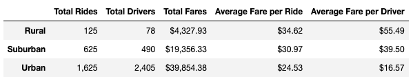
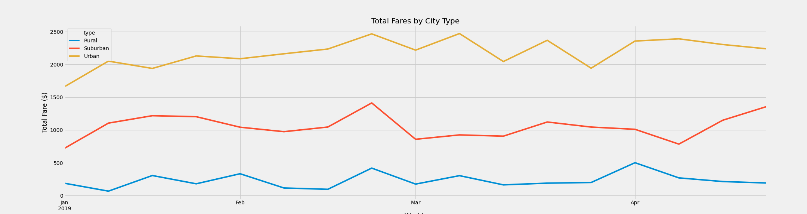

# PyBer Analysis

## Overview

### Purpose
Using PyBer ride data, we want to analyze the ride-sharing data by city type by comparing total rides, total drivers, total fares, average fare per ride, and average fare per driver. We will also analyze total weekly fares for each city type for any seasonality patterns. By seeing how the data differs by city type, we want PyBer to use those differences to drive the business forward. 

### Data files
Two raw data files are provided:
1. city_data.csv contains the name of the city, how many drivers are in the city, and the type of city - one of urban, suburban, and rural
2. ride_data.csv contains the city, date, fare paid, and ride ID for each ride from January to April

## Results

First we look at a ride-sharing summary DataFrame by city type:

### Comparing ride-sharing data by city type
- Total Rides
    - The number of Urban rides is the highest, at 2.6x of Suburban riders, and 13x of Rural riders.
- Total Drivers
    - The number of Urban drivers is 2,405, the highest of the three city types. Urban drivers are 4.9x of Suburban drivers, and 30.8x of Rural Drivers. There are more Total drivers in the Urban cities than the Total Rides.
- Total Fares
    - The total fares for Urban cities is the highest, at almost 2.06x of Suburban fares, and 9.2x of Rural fares.
- Average Fare per Ride
    - Rural cities' average fare per ride is the highest amongst the three types of cities. It is likely that rural rides travel a further distance compared to the Suburban and Urban rides. 
- Average Fare per Driver
    - Rural cities' average fare per driver is also the highest amongst the three types of cities. There are less drivers in the rural cities, so each driver get a bigger slice of the pie. 

### Total Fare by City Type Over Time
Next we look at a multiple-line chart of total fares for each city type:

Regardless of seasonality, Total Urban fares for each week are the highest amongst the three city types. Between early March to late March, there is a decrease in Weekly Total Fares for Urban cities.

Suburban fares has a spike in late February, decreases slightly, and increases starting in early April. 

Rural fares has smaller spikes in late February, and early April, but it otherwise flat. 

We should further analyze the reasons behind the spikes. In total, the total weekly fare does not appear to be increasing by a significant amount. We should analyze this as well to look for opportunities to grow the business. 

## Summary

Based on these results, here are three business recommendations to the CEO for addressing any disparities among the city types:

### Recommendations
1. There are more drivers than rides in Urban cities in the data set. There are more drivers than there are customers to service in these cities. PyBer should highlight this fact to market its service, using shorter wait times as an incentive for potential riders. 
2. PyBer should incentivize drivers to accept more suburban and rural rides, where the ratio of drivers to rides is much lower but fares are higher per ride, and per driver. 
3. To close the gap between Urban, Suburban, and Rural average fare per ride, PyBer should re-evaluate its current fare calculations for distance traveled. Rural and suburban rides will usually be longer distances, and a lower cost per distance travelled may induce customers to use the PyBer service more, and drive less. 